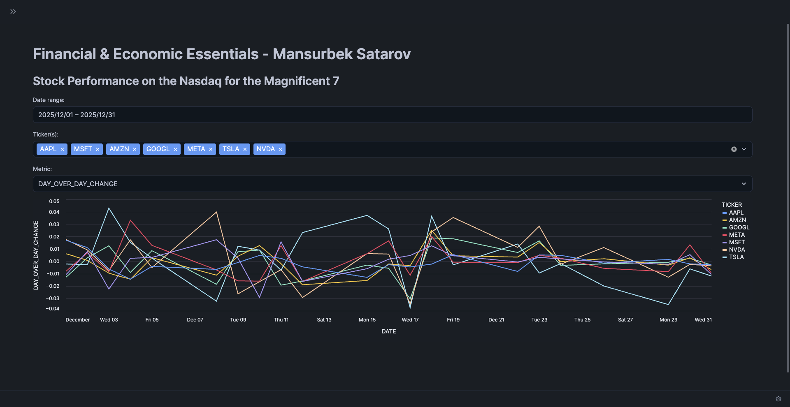
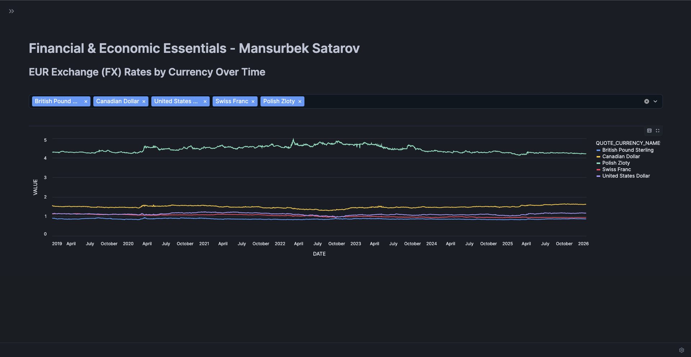

# 🚀 Snowpark + Streamlit Financial Analytics App

A modern **data application built inside Snowflake** using **Snowpark for Python** and **Streamlit**, designed to analyze and visualize **stock market performance** and **foreign exchange (FX) rates** in real time.

---

## 📊 App Preview

<!-- Replace these with your actual screenshots -->




---

## 🧠 Overview

This project demonstrates how to build and deploy a **fully interactive data application directly within Snowflake**.

Using **Snowpark**, we process large-scale financial datasets from the **Snowflake Marketplace**, and with **Streamlit**, we turn that data into an intuitive, interactive dashboard.

> ⚡ No external backend. No data movement. Everything runs inside Snowflake.

---

## ✨ Key Features

* 📈 **Stock Market Analysis**

  * Track performance of major tech companies (Magnificent 7)
  * Visualize:

    * Day-over-day changes
    * Post-market closing prices
    * Trading volume

* 💱 **FX Rate Visualization**

  * Explore EUR exchange rates across multiple currencies
  * Interactive filtering and time-series charts

* 🎛️ **Interactive UI**

  * Dynamic date range selection
  * Multi-select filters for tickers and currencies
  * Real-time chart updates

* 🔐 **User Access & Sharing**

  * Snowflake role-based access control
  * Public and role-based app sharing

---

## 🏗️ Architecture

```text
Snowflake Marketplace Data
        ↓
   Snowpark (Python)
        ↓
 Data Transformations
        ↓
    Streamlit App
        ↓
  Interactive Dashboard
```

---

## 🛠️ Tech Stack

| Layer         | Technology          |
| ------------- | ------------------- |
| Data Platform | Snowflake           |
| Processing    | Snowpark for Python |
| Frontend      | Streamlit           |
| Visualization | Altair              |
| Data Handling | Pandas              |

---

## 📂 Project Structure

```bash
.
├── streamlit_app.py      # Main Streamlit application
├── assets/               # Screenshots and visuals
├── README.md
```

---

## ⚙️ How It Works

### 1. Data Loading

* Uses Snowpark session to query:

  * `STOCK_PRICE_TIMESERIES`
  * `FX_RATES_TIMESERIES`

### 2. Data Transformation

* Aggregations (volume, closing price)
* Window functions (day-over-day changes)

### 3. Visualization

* Interactive charts built with Altair
* User-driven filtering via Streamlit widgets

---

## 🚀 Running the App (Snowflake)

1. Go to **Snowsight**
2. Navigate to **Streamlit**
3. Create a new app
4. Paste `streamlit_app.py`
5. Click **Run**

---

## 🔗 Live App

👉 *[Streamlit app URL](https://app.snowflake.com/streamlit/east-us-2.azure/yva83163/#/apps/za2qfyrfedx4baqcihvk)*

---

## 👤 User Sharing Setup

* App shared with:

  * `PUBLIC` → View access
  * Custom roles → Controlled access
* Demonstrates **Snowflake-native app sharing**

## 🎯 Learning Outcomes

* Built a **native Snowflake application**
* Used **Snowpark for scalable data processing**
* Designed **interactive dashboards with Streamlit**
* Implemented **role-based access control**
* Deployed and shared apps inside Snowflake

---

## 📌 Future Improvements

* Add ML predictions (Snowpark ML)
* Real-time streaming data
* User authentication dashboard
* Export reports (PDF/CSV)

---

## 🤝 Author

**Mansurbek Satarov**
Data Science Enthusiast

---

## ⭐ If you like this project

Give it a star ⭐ and feel free to fork!
